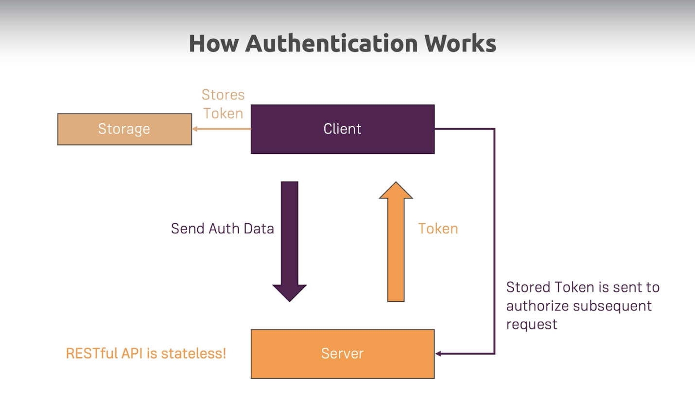
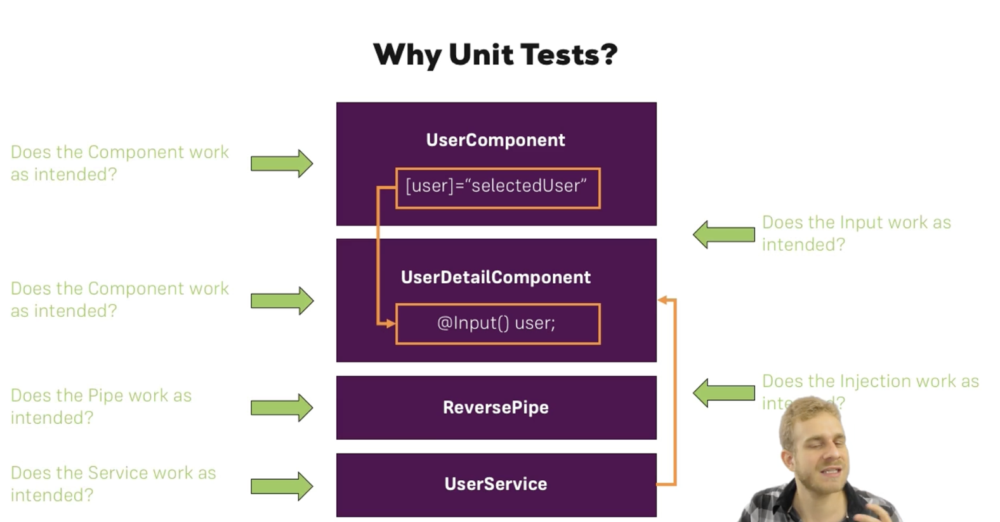

# Angular

Angular is a Javascript Framework which allows us to create reactive single page application.
Although we seem to visit different pages but it is a single page, with one html file and bunch of javascript code, every change is rendered in browser.
It helps with building interactive, modern web user interface.
Angular is also a collection of tools and features like CLI, Debugging tools, IDE plugins.
Framework like Angular simplify the process of building complex, interactive web user interfaces.

Angular bring these four main things to the table-

1. We can write declarative code instead of the imperative code. In imperative code we write step-by-step instructions that tell the browser what to do. In declarative code be define the target states, so in the some markup that are unlocked by angular that will not work with just vanilla javascript. And then we write the logic when these state got activated and deactivated when a event occurs, and then its Angular job to update the visible user interface.
2. Separation of concern via component. These are custom html elements. We can break up complex applications into simple building blocks, split up responsibilities and concerns, build a component once and reuse it as much as we want. Overall better development process. Modular application.
3. Embraces some object oriented programming features.
4. Typescript

Because it gives the user very reactive user experience. Javascript is much faster than to reach out server for every change.
And if we need data from the server we simply load the data in background, so the user get the same experience.
In this, Javascript, DOM changes, whatever displayed on the page (HTML code) during runtime. That's why we never see the refresh icon.

# Angular versioning

AngularJs (Angular 1) - Was not future proof due to the way it was written.
Angular1, Angular2, Angular4 ... (Angular3 was skipped)

Angular 2 - Was a complete rewrite of AngularJs. It was a complete new framework.
Angular has been super stable framework. Any changes are made in very backward-compatible way.

Angular 14 introduced standalone components.
Angular 16 introduced signals.

Updating npm:

    Run [sudo] npm install -g npm (sudo is only required on Mac/ Linux)

Updating the CLI

    [sudo] npm uninstall -g angular-cli @angular/cli

npm cache verify

    [sudo] npm install -g @angular/cli

    use ng serve --port ANOTHERPORT to serve your project on a new port

My changes are not reflected in the browser (App is not compiling)

Check if the window running ng serve displays an error. If that's not the case, make sure you're using the latest CLI version and try restarting your CLI.

Why we need Angular CLI?
We need such an extra tool to create angular projects, because the code we write when using the angular will actually will not be the code that runs just like that in the browser, instead it will need to be converted and optimized since we will use features in our angular code that are not native Javascript features. That's why we need a separate project that basically includes a build step that converts the code we write during development to code that can run in the browser once we are ready to ship and deploy the project.

To create the new app-

    ng new my-app

we can add three flags/configurations

    [sudo] ng new my-app --no-strict --standalone false --routing false

To run the development server

    [sudo] ng serve

To create the component folder

    [sudo] ng generate component my-component
    [sudo] ng g c my-component
    [sudo] ng g c my-component --skip-tests
    [sudo] ng g c my-component/nested

Angular first load the index.html page then we have these dynamically injected script imports and there imports will dynamically replace app-root with our own component.

# TypeScript

TypeScript is superset to the vanilla javascript. (Programming language extending javascript) It has more robust code which get checked when we write not just when we run. It have more features like (e.g Types, Classes, Interfaces, ...). But in the end as typescript can't run in the browser it is compiled to javascript and this compilation is handled by the cli (a project management tool).

It adds static typing to javascript

npm install typescript
npm tsc //to compile the file, will figure out which file to compile from the config file if there is no config file we can still give the file we want to compile at the end of the command.

//Primitive types: number, string, boolean
//More complex types: arrays, objects
//Function types, parameters

    let age: number = 12;
    let hobbies: string[];
    let person: { name: string; age: number; }; //tells the type of the variable is object
    let person: {}[];

--Type Inference
By default, tries to infer as many types as possible, without us giving the type of the variable.
Generally it is best practice not to assign the type of the variable which is initialized as soon as it is declared as it will be redundant.

--Union types

    let age: number | string = 12;

It allows us to save more than one type of data in our variables.

--Assigning Type Aliases

    type Person = {
    name: string;
    age: number;
    }
    let person: Person;
    let person: Person[];

--Function and types

    function add(a: number, b:number): number{
    return a + b;
    }

//as long as the typescript is able to infer the type of the function then avoid giving it explicitly.

--Generics

    function add<T>(a: T[], b:T): number{
    return a + b;
    }

//Generics are used when we want to create a function that can work with different types of data.
//This will automatically infer the return type based on the type of the parameters.

--class
Within the class to define a method we use the method shorthand notation.

    methodName(){

    } //we can't use the function keyword to create a method

--interfaces
doesn't exist in the vanilla javascript

    interface Human {
    name: string;
    age: number;

        greet: () => {}

    }

    let mac: Human;
    mac = {
    name: 'mac',
    age: 12,
    greet: () => {
    console.log('Hello');
    }
    }

//it look similar to the type but there is key difference is that interfaces can be implemented by classes and it forces that class to have that structure.

    class Teacher implements Human {

    }

    npx tsc --init

will add the tsconfig.json

    @Input() avatar!: string;
    //The ! mark told that  that value of the variable will be initialized even though typescript can't find it in the code.

     @Input({ required: true }) avatar!: string;
     //Ensures that the input has the definitely a value initialized otherwise it will throw the error.

npm install --save bootstrap@3

# The Basics

As angular single page application the first page that is loaded is index.html. Index.html has <app-root></app-root>, which is not the standard html tags but one of our own components.
@Component decorator, have selector property which assigns string as value and it holds the app-root described in index.html. This is the information angular needed to replace with the template of this component.
When we run the ng serve, it automatically creates javascript script bundles and automatically add the right imports in the index.html file, a convenience method for us.
After that first code to be executed is main.ts file. Now this starts our angular application by passing an app.module to the

    platformBrowserDynamic().bootstrapModule(AppModule)

method.
The AppModule is the root module of our application. It is the entry point of our application. It is the module that is responsible for bootstrapping.
AppModule comes from app.module,ts file, in which @NgModule have an object in which there is bootstrap array which basically lists all the components that should be know to angular at the point of time, it analyzes our index.html file.
Therefore angular knows about the AppComponent, it reads app.component.ts file and therefore knows this selector app route in turn its knows the html and css file with which to replace our app-root.

# Angular Essentials

## Project Structure

tsconfig files simply control how typescript code will be compiled to the typescript code under the hood. The compilation will be triggered automatically by angular cli.

package file manage the dependency of our applications.

angular.json which contains extra configurations settings for angular cli and angular related tools.

.editorconfig file contain rule for code editor for how the code should be formatted.

src>app where we build our angular components and write angular code.

style.css sets global style that will apply to the entire web application across all components.

index.html file is the main html file which will be loaded when the visitor visits website.

main.ts first code file to be executed when the angular application is loaded in the browser.

assets file where we could store images.

## Components

Decorators like @Component are used by Angular to add metadata & configuration to classes (and other things, as you'll see throughout the course).

In addition, TypeScript gives you more control over how properties are defined in classes.

There is main app component, root component which holds our entire application. So this root component, to this template, this html file off the app component is where we will add other components.
These component have their own template , own styling and they can be used more than once.

The nested components will not be added to the index.html file but the root component html file.
Their selector will be added to app component HTML file. As the whole application is bootstrapped with the root component.

    if inside the component we set the standalone property as true it will mark the component as standalone component. Component where standalone property is false are called module based component.

The standalone property is only available in angular 14 and above.
Despite the standalone property being true or false the way we work with the components and general features are same.

The aim behind the component tree is that the component that are the part of the same application or same tree will be able to work together and communicate with each other.

We have to register the App components in order to use them in them other components. For older angular version(ogv) we can do so by going in app.module.ts and in ngModule decorator providing the component in the declarations. For new Angular version (ngv) we need to provide the component in the component decorator imports of the component where we wish to use it.

In ngv you have to add the src/asstes to the the asset in angular.json

## AppModule and Component Declaration

AppModule is the bundle of functionality of our app and it basically gives angular the information which feature does my app have and use. It is an empty typescript class and we transform it by adding a decorator.
We don't add any other component than the AppComponent to the bootstrap array, as in this we want to add only those component which we will need at the time of starting our application in our index.html file.

We will add other component which is part of the app but not needed at the time of running the application in declarations. declarations already contains our AppComponent as it is also the part of the app.

The main idea behind Standalone Components is that you can build Angular components & apps without (or with less) @NgModules - i.e., Standalone Components allow you to write less (boilerplate) code.

You build a standalone component by adding the standalone: true property/value pair to the @Component decorator.

Like this:

    @Component({
    standalone: true,
    selector: 'app-cmp',
    template: '<h1>I work standalone!</h1>'
    })
    export class SomeComponent {}

Such components then don't have to (and shouldn't be) added to any @NgModule.

Therefore, if you only work with such components, no @NgModule is needed at all.

## Creating components with CLI and nesting components

ng generate component <component-name> or ng g c <component-name> will create a component with the name <component-name> and it will be added to the app.module.ts file.
This command allows us to generate some elements supported by angular like component.

## working with component template

We can write the template code within the templateUrl if we want.
styleUrls takes an array as our html page can have multiple style files.
We can give inline styles using the styles property instead of styleUrls. styles property also take the array as an argument but the style written in inline.

## Component Selector

component selector acts like a css selector. so we can do much more just like with the css selector.
we can give the selector as an attribute '[selector-name]' (should be string ''), this way we can't use it as tag but as the attribute of an element, for ex 

.
Another way is as class like in css, '.selector-name' then we can use it as 

.
But selecting by id and pseudo selectors will not works as they are not supported.

## Databinding

Communication between the typescript code(Business logic) and template(HTML).
We want to output data from our typescript code in the HTML code we can do so by

     String interpolation {{ data }} or Property Binding [property]="data" .

     [src]="'../../assets/users/' + selectedUser.avatar".
     We can create dynamic value in jit

But such computation should not be done inside the template
We can do it in the component class and then pass it to the template.

    get imagePath() {
        return '../../assets/users/' + this.selectedUser.avatar;
    }
    //This is a getter function
    

Property Binding" - a key Angular feature that allows you to bind element properties to dynamic values.

For example,  binds the src property of the underlying HTMLImageElement DOM object to the value stored in someSrc.

Whilst it might look like you're binding the src attribute of the  tag, you're actually NOT doing that. Instead, property binding really targets the underlying DOM object property (in this case a property that's also called src) and binds that.

For example, when binding ARIA attributes, you can't target an underlying DOM object property.

Since "Property Binding" wants to target properties (and not attributes), that can be a problem. That's why Angular offers a slight variation of the "Property Binding" syntax that does allow you to bind attributes to dynamic values.

It looks like this:

    
...

By adding attr in front of the attribute name you want to bind dynamically, you're "telling" Angular that it shouldn't try to find a property with the specified name but instead bind the respective attribute - in the example above, the aria-valuenow and aria-valuemax attributes would be bound dynamically.

And we can react to user event with event Binding (event)="expression".
We can also use two way binding [(ngModel)]="data" to bind the data in both direction.

We can also use ngClass to add class dynamically and ngStyle to add style dynamically.

String interpolation has only one condition as long as anything between {{ }} is resolved to a string it will work we can even pass function in this. Also we can't write multiline expressions here, so that's why we can't use if and for control structure but can use ternary operator.

In property binding we directly bind to the native property the element has.

If we want to output something on our template then we should use the string interpolation, but if we want to change the some of property of HTML element or component the we should use property binding.

## Even Binding

we can react to user event with event Binding

    (event)="expression". (event) is the event we are waiting for, and expression is something that should happen when the event occurs.

How do you know to which Properties or Events of HTML Elements you may bind? You can basically bind to all Properties and Events - a good idea is to console.log() the element you're interested in to see which properties and events it offers.

Important: For events, you don't bind to onclick but only to click (=> (click)).

The MDN (Mozilla Developer Network) offers nice lists of all properties and events of the element you're interested in. Googling for YOUR_ELEMENT properties or YOUR_ELEMENT events should yield nice results.

## Passing and using data with the event binding

To get the value the user enter we need to pass the $event as the argument in the expression for the event listener.
(input)="onUpdateUser($event)".
$event is a reserved variable name that we can use in the template when we are using event binding. $event as an argument will simply be the data emitted with that event. When these event are fired they emit some data and we can catch this data and pass it by using $event.

## Two way Data Binding

Important: For Two-Way-Binding (covered in the next lecture) to work, you need to enable the ngModel directive. This is done by adding the FormsModule to the imports[] array in the AppModule.

You then also need to add the import from @angular/forms in the app.module.ts file:

    import { FormsModule } from '@angular/forms';

    [(ngModel)]="field-name"

it provides two way data binding, so that it will trigger the input event and update the field-name in our component and also if the field-name is changed then it will update the value of input element.

    ngModel requires that it is within the form and the input have a name attribute.

## State change - zone.js

Zone.js is a library that allows you to run code in a zone.
A zone is a context in which you can run code and have it run in a specific way.
Angular uses zone.js to create so-called zones around our components, which in the end kind of invisible grouping mechanism where it listens for all kinds of events that could trigger state changes.
For example, you can run code in a zone that will automatically run change detection when the code is done running.

What Zone.js is that it automatically listens to all possible user events that could occur on a website for example, as well as some other possible events that could occur. Like a timer expiring,
when such a event occurs, it checks the angular application for possible changes and make them.

    export class UserComponent {
     selectedUser = DUMMY_USERS[randomIndex];

     get imagePath() {
       return '../../assets/users/' + this.selectedUser.avatar;
     }

     onSelectUser() {
       const randomIndex = Math.floor(Math.random() * DUMMY_USERS.length);
       this.selectedUser = DUMMY_USERS[randomIndex];
       console.log(this.selectedUser);
     }

    This is one way of doing state change in which we rely on Zone.js and angular's change detection mechanism. This works automatically, no special instruction required. Supported since angular 2.

    And the other mechanism uses a concept called signal.

## Signal

Using signals to notify angular about value changes and required UI updates. Require usage of special signal instruction and code. Supported since angular 16.

    Signals are trackable data containers
    A signal is an object that stores a value(any type of value, including nested objects).
    And then we can use that value in the template.
    And angular therefore able to setup a subscription behind the scenes which will make sure that when we change that value, angular will be notified about the change, then angular is able to identify in our template where the value (signal) is being used and update these places.

This is how we can create a signal

      export class UserComponent {

        selectedUser = signal(DUMMY_USERS[randomIndex]);

      get imagePath() {
        return '../../assets/users/' + this.selectedUser().avatar; //this is how we access the value inside the user
      }

      onSelectUser() {
        const randomIndex = Math.floor(Math.random() * DUMMY_USERS.length);
        this.selectedUser.set(DUMMY_USERS[randomIndex]);
      }
    }

Advantage of the signal is that it can get rid of Zone.js and this zone concept. So it allows angular to perform change detection and UI updating in more efficient manner. It doesn't have to check everything for every possible event that could anywhere.

For signals unlike zone we will not use getter but

    imagePath = computed(
    () => '../../assets/users/' + this.selectedUser().avatar
    );

Angular analyzes if we are reading the value inside the computed function, and if that's the case it again sets up a subscription to that signal that's being used in here, and whenever the signal receives a value and only then angular will recompute the image path here. So it's efficient it will not check everything in the component only this property which is being recomputed.

We can use the signals with the input also

    avatar = input();
    avatar = input(''); //sets the default value ''
    avatar = input<string>(''); //sets the default value '' and tells the it is of type string
    input.required<string>(); //tells that should have value.

These input signals are read only signals that means their value change only outside the component we can't change the value from inside the user component.

## Output and Emitting Data

      @Output() select = new EventEmitter();

       <app-user
        [id]="users[1].id"
        [avatar]="users[1].avatar"
        [name]="users[1].name"
        (select)="onSelectUser($event)"
      ></app-user>

There is another way of emitting data instead os using output decorator we can use output function.

    select = output<string>();

This is not give us a signal, and like the output decorator it also give us custom event we can emit.

## Working with potentially undefined values

    @Input() name?: string; or  @Input() name: string | undefined;
    tells the user can be undefined or string
    [name]="selectedUser?.name"
    tells if selectedUser is undefined so use undefined

## Type aliases and interfaces

Sometimes defining the type of variable as object within the component can become cumbersome as they are can be quite large, it is better to outsource them.
Type aliases are used to define the type of variable.
Interface can also do the same but they are only applicable for objects

    type User = {
    id: string;
    avatar: string;
    name: string;
    };

    interface User {
        id: string;
        avatar: string;
        name: string;
    };

## Directives

With angular, we can enhance the elements by adding so-called directives to them.
Directives are instruction in DOM. Components are such kind of instructions in the DOM. As when we use the selector of the component in the template we are instructing the angular to put the component template in the place of this selector in the template that contain the selector.
Component are a kind of the directives with template.
Directive unlike components don't have template.
There can be directives without the template to, we can build such custom directives. We typically add directives with attribute selector, but technically selector of a directive can be configured just like the selector of a component.

    

ngif is a directive shipping with angular.
ngif is a directive that is used to conditionally render the template. It takes the condition as the argument and if the condition is true then it add the element.
ngif is a structural directive as it changes the structure of our dom, it either add the element or not add it. \* is required in prefix of ngif (\*ngif) otherwise it will not work. As it is a structural directive normal attribute directive doesn't require \*.

If you're in an Angular 17 project (and only then!), you can also use an alternative syntax for outputting conditional content:

Instead of using \*ngIf, you can use a built-in @if template control flow statement.

    @if (someCondition) {
      
Only visible if 'someCondition' is true

    }

would replace

    
Only visible if 'someCondition' is true

The advantage of the new syntax is that it can be slightly more efficient under the hood and that it does not rely on NgIf or the CommonModule being imported / available.

we can also use ngif with else

    

    {{ serverName }}
    

    <ng-template #noServer> //This is an local reference that can we used in the template
      
No Server Created

    </ng-template>

ngStyle allows us to dynamically set the style, ngClass allows us to dynamically add and remove CSS classes.

    <h5 [ngStyle]="{ backgroundColor: getColor() }">
     Server with ID {{ serverId }} is {{ getServerStatus() }}
    </h5>

Here ngStyle only works with property binding, here it binds the property of the directive not the directive itself. It takes object as an argument with style name as key and it value as value.
ngClass also only works with property binding.

    <h5 [ngStyle]="{ backgroundColor: getColor() }"
    [ngClass]="{online: serverStatus === 'online'}">
     Server with ID {{ serverId }} is {{ getServerStatus() }}
    </h5>

ngClass also takes object as an argument with key being the CSS class name and value being the expression which tell us that whether to add this CSS class or not.

ngFor Directive

    

If you're in an Angular 17 project (and only then!), you can also use an alternative syntax for outputting conditional content:

Instead of using \*ngFor, you can use a built-in @for template control flow statement.
The track is used as since we are outputting data dynamically here and angular want to keep the track of every item that is being rendered so that if list input data would change. Angular could use already rendered item list instead of recreating the entire list.
Track tells which unique identification criteria angular could assign to every list item it outputs.

    @for (item of items; track item.id) {
      <li>{{ item.title }}</li>
    }

    @for (user of users; track user.id) {
    <li>
      <app-user [user]="user" (select)="onSelectUser($event)"></app-user>
    </li>
    }

would replace

    <li *ngFor="let item of items">{{ item.title }}</li>
    <li *ngFor="let item of items; let i = index">{{ item.title }}</li>

The advantage of the new syntax is that it can be slightly more efficient under the hood and that it does not rely on NgFor or the CommonModule being imported / available.

The track item.id part is required when using this new syntax - it ensures that Angular can efficiently track and re-render (if needed) the list items.

NgModel Directive is an Element enhancement that helps with extracting (or changing) user input values.

    <input ngModel>

We can also use signals with ngModel

## Dynamic CSS styling with class bindings

    <button [class.active]="selected" (click)="onSelectUser()">
    //Here we can use this and set the property value to true or false.

## Handling Form Submission

The for submission is automatically prevented if we are importing FormsModule. Because inside this form module includes a component built by the angular team, which uses the form element tag as a selector and thus take control of the form under the hood automatically.
This form component which took control of the form will listen for the submission event and prevent it from happening.
But we still want to perform some action of our own when the form is submitted. We can do so by using ngSubmit.

    (ngSubmit)

## Content Projection

Content projection is a way to pass content into a component.
We can use ng-content to pass content into a component.
If we want to use another component template as a wrapper around the another component we need to pass the ng-content where we want to wrap it or otherwise it will ignore any content other than define in its own component template by default.

    app-card component
    

     <ng-content></ng-content>
    

    wrapped component
    <app-card>
    <button [class.active]="selected" (click)="onSelectUser()">
      
      {{ user.name }}
    </button>
    </app-card>

## Pipes

Pipes are the output transformers, things that transform output in templates.

     <time>{{ task.dueDate | date }}</time>
     //this will transform the date to particular type which is described by the angular built in transformer date.

     <time>{{ task.dueDate | date: 'fullDate' }}</time>

## Services

The idea behind services is that typically it performs a operation and/or manages some data.
In order to keep our component code lean and clean which is generally the practice it is better to make utilization of services.
We can instantiate the service class and make use of that in other components but the problem with this approach is the instance used in each component will be unique, we wouldn't be sharing the same object, so even if we make changes in data in one component it will not be reflected in other component.

The solution to this is to use another powerful tool in conjunction with services is Dependency injection. The idea behind the di is that we don't create the instance but tell angular to do it and let it create it.
We tell angular what type of value we need and angular creates it and provides it as an argument.

One way to do it is using the constructor of the other component.
And We can use the @Injectable() decorator to tell angular that this class is a service and can be injected into other components.

    private taskService: TaskService;
    constructor(taskService: TaskService) {
      this.taskService = taskService;
    }

    or
    constructor(private taskService: TaskService) {}
    //this will create the instance of the service and inject it into the constructor.
    but angular will not automatically scan all the files and folders for the TaskService class we have to made it injectable and we can do so by

    @Injectable({ providedIn: 'root' })
    export class TaskService {}

One other way is using inject function of angular core module.

      private taskService = inject(TaskService);

inject function inject a dependency and provide it as a value for the taskService property.

## Using local storage for Data Storage

    constructor() {
       const tasks = localStorage.getItem('tasks');

    if (tasks) {
      this.tasks = JSON.parse(tasks);
    }
     }

     private saveTasks() {
       localStorage.setItem('tasks', JSON.stringify(this.tasks));
     } // we can call this function wherever change in task data occurs

# Angular Essentials - Working with modules

Aside from standalone way of building components we can use one more way of building components, which is Angular modules.
We can use Angular modules for grouping components together and for structuring our application.
Angular modules exist due to historic reasons, as there was no standalone components when angular 2 was released in 2016.

The difference between these two is that the other component that we use in a component need to be specified in the imports of that component in standalone components but in angular modules instead of importing the components on per component basis, we instead create a module that simply combines all the components.
The advantage is that the component configuration gets leaner but on the other side we have to create separate module and it is not clear which component is using which other component.

We need to use this to bootstrap angular app in main.ts

    platformBrowserDynamic().bootstrapModule(AppModule);
    //AppModule is the root module of our application
    //bootstrapModule is a function that takes a module as an argument and bootstraps the application
    //platformBrowserDynamic is a function that returns a platform object that can be used to bootstrap the application

After that we can either remove the standalone and import config from component or set standalone to false and remove imports. Then create app.module.ts and

    @NgModule({
      declarations: [
        AppComponent,
        UserComponent,
        TasksComponent,
      ],
      bootstrap: [AppComponent],
    })
    export class AppModule {}

We can also keep the component standalone while using the angular module by adding the import configuration in NgModule decorator in app Module.
It can be useful in the case when we are migrating from one to another.

    @NgModule({
         declarations: [
           AppComponent,
           UserComponent,
           TasksComponent,
         ],
         bootstrap: [AppComponent],
         imports: [BrowserModule, FormsModule, NgModule],

    })
    export class AppModule {}

We don't need to have only one module, if our application is large it is better to break the app module into multiple modules.

    @NgModule({
    declarations: [CardComponent],
    exports: [CardComponent],
    })
    export class SharedModule {}
    //We can mention the component that is needed and also needed to mention the component in the export to tell the angular the Card Component is available to all the modules that uses the shared module.

## Union Types

To allow for multiple types in a single value you can use Union Types: myVal: number | string

# Angular Essentials - Time to practice

The project structure of this section has one important difference compared to the structure from the previous section: Images (and statically served assets in general) are now stored in the public/ folder - NOT in a nested assets/ folder!

To reference images stored in the public/ folder you would use a path like this:  - i.e., the public folder name is NOT part of that path (it's NOT )

# Debugging

Javascript files supports source maps, source maps are a little of addition, DCLI adds kind of adds to our bundle which allow the browser to translate our javascript code to typescript code or to map simply our javascript code to our typescript file. In the development only these source maps will be stripped out for production.

In order to debug our typescript files we can go to the developer mode> sources> webpack> . folder> src> app.

Here we can see our typescript files and we can set the breakpoints and debug our code.

# Components and DataBinding Deep Dive

We can use property and even binding not only on HTML elements and their native properties and events, but also on directives. But we can also use it on our component and bind to our custom properties and events. We can emit our own events.

    By default all properties of components are only accessible inside the components not outside, and this is a good thing as we wouldn't want to bind all the properties from the outside.

So if we want to allow the parent components bind to the property of the child components, we need to add the decorator to that property. Decorator are not only available for the classes.

    We need to add the @Input () decorator to the property that we want to allow to be binded by the parent components.

We can pass the alias inside the @Input('alias-name') then we can bind using the alias-name only not the original property name.

## View Encapsulation

Angular provides three different ways to encapsulate the styles of a component:

- Native/ ShadowDom
- None
- Emulated (Default)

By default the browser tries to propagate the css styling, but the angular override this functionality of browser and make sure that the styling defined in the css file of the component should apply to that component only.

Each element in angular has a specific attribute associated with it, these are applied by angular. So when we set a style for something like paragraph it doesn't just say set the style of the paragraph but tells that set the style of all the paragraph with this particular attributes associated with them. It by itself changes the style selector and add these attribute selector to all our styles defined for a component.
It kind of emulates shadow dom, which is a technology not supported by old browsers where each element has its kind of own shadow dom behind it where we can then assign styles to each element.
This is the default behavior of view encapsulation in angular.

In the component we can set the encapsulation mode according to us

    @Component({
        selector: 'app-root',
        templateUrl: './app.component.html',
        styleUrls: ['./app.component.css'],
        encapsulation: ViewEncapsulation.None //will make so that there is no view encapsulation as a result property defined it will apply globally affecting other components.
    })

Native, now called ShadowDom uses the shadowDom but gives same result as emulated but works only in the browser that support shadow dom, so it is better to use emulated.

## Local References

In our template we can create local references. It can be placed in any html element not only input. We can add it with #localReferenceName in our html element. This reference that we create holds a reference to the element in which it is created.
The reference is just not to value but to the whole HTML element with all its properties.
Local reference can only be used in the template not in the typescript code.

## View Child

In Angular 8+, the @ViewChild() syntax which you'll see in the next lecture needs to be changed slightly:

Instead of:

@ViewChild('serverContentInput') serverContentInput: ElementRef;
use

@ViewChild('serverContentInput', {static: true}) serverContentInput: ElementRef;
The same change (add { static: true } as a second argument) needs to be applied to ALL usages of @ViewChild() (and also @ContentChild() which you'll learn about later) IF you plan on accessing the selected element inside of ngOnInit(). As we will also use the selected element in ngOnInit.

If you DON'T access the selected element in ngOnInit (but anywhere else in your component), set static: false instead!

If you're using Angular 9+, you only need to add { static: true } (if needed) but not { static: false }.

We can directly gain access to the local reference or to the element directly from our typescript code using ViewChild. The local reference accessed in our typescript code is of the ElementRef type which is a angular type. This has native element property which give access tot he underlying element which now has a value.

## Lifecycle of components

As angular create component it goes through some of phases, and give us the opportunity to hook into those phases and execute some code.
The phases/hooks are-

1. ngOnChanges -> First phase we can hook onto, It can execute multiple times, first when the component is created then called after a bound input property changes each time (Properties decorated with @Input()). Takes an argument of type SimpleChanges, called before ngOnInit().
2. ngOnInit() -> Executed once the component has been initialized. ngOnInit will execute after the constructor.
3. ngOnCheck() -> called during every change detection run. Change detection is simply the system by which angular determines if something has changed on the template of the component.
4. ngAfterContentInit - called after content (ng-content) has been projected into view.
5. ngAfterContentChecked - Called every time the projected content has been checked.
6. ngAfterViewInit - Called after the component's view (and child view) has been initialized. Can't access the element before this/
7. ngAfterViewChecked - Called every time the view (and child views) have been checked.
8. ngOnDestroy -> called once the component is destroyed.

## Content child

content child is just like the view child but is used to access the element that are not part of the view but the part of the content.

# Directives

There are two types of Directive-
Attribute Directive - As they sit on elements just like attributes.
Look like a normal HTML Attribute( possibly with databinding or event binding). Only affect/change the element they are added to.

Structural Directives - Basically do the same but also change the structure around the element. Look like normal HTML attribute but have a leading \* (for desugaring). Affect a whole area in the DOM (elements get added/ removed).

import { Directive, ElementRef, OnInit, Renderer2 } from '@angular/core';

Custom Directive using the renderer

    @Directive({
      selector: '[appBetterHighlight]',
    })
    export class BetterHighlightDirective implements OnInit {
      constructor(private elementRef: ElementRef, private render: Renderer2) {}
      ngOnInit() {
        this.render.setStyle(
          this.elementRef.nativeElement,
          'backgroundColor',
          'blue'
        );
      }

Custom Directive using elementRef

import { Directive, ElementRef, Input, OnInit } from '@angular/core';

    @Directive({
      selector: '[appBasicHighlight]',
    })
    export class BasicHighlightDirective implements OnInit {
      constructor(private elementRef: ElementRef) {
        console.log('BasicHighlightDirective constructor');
      }
      ngOnInit() {
        this.elementRef.nativeElement.style.backgroundColor = 'green';
      }
    }

It is better to use the render then the element ref to directly manipulate the dom style as it always not be the case we are running our angular app for browser and thus me may not have access to the dom.

We can use HostListener decorator to listen to any event in our directive and make changes according to those events

    @HostListener('mouseenter') mouseover(eventData: Event) {
        this.render.setStyle(
          this.elementRef.nativeElement,
          'background-color',
          'green'
        );
      }

      @HostListener('mouseleave') mouseleave(eventData: Event) {
        this.render.setStyle(
          this.elementRef.nativeElement,
          'background-color',
          'red'
        );
      }

There is one more easier way than render to set the background Color if this is all we want to do. We can use the HostBinding decorator.
Using HostBinding we tell that on whichever element this directive sits, please access the style property and on that style property access the background color and set this to particular color.

    @HostBinding('style.backgroundColor') backgroundColor: string = 'red';

If we want to make so that some of the properties are set by the user as they use our directives and ship the properties they want to use, we can do so by custom property binding. Custom event binding also works in the directives.

    @Input() defaultColor: string = 'transparent';
    @Input() highlightColor: string = 'blue';

    

     

And then use these values to set the properties of the properties.
Since the binding to directive properties is same as property binding, angular need to figure out if this binding belong to the element or the directive and it do so by simply checking the element own directive and then our custom directive.
If we want to bind to the property of the directive that has same name as our directive selector we can do so by simply giving an alias for custom property that we are taking as input.

    

     

## Structural Directive

ng-template does not render itself but allows us to define a template for angular to use and render it.

     

          <li
            class="list-group-item"
            [ngClass]="{ even: evenNumber % 2 == 0 }"
            *ngFor="let evenNumber of evenNumbers"
          >
            {{ evenNumber }}
          </li>
        

This is the ngif code and we use star as it translates to

     <ng-template [ngIf]="!onlyOdd">
          <li
            class="list-group-item"
            [ngClass]="{ even: evenNumber % 2 == 0 }"
            *ngFor="let evenNumber of evenNumbers"
          >
            {{ evenNumber }}
          </li>
        

        </ng-template>

# Services and Dependency Injection

Angular uses a concept called Dependency Injection (DI) to provide services to components.
A service is a class that provides some functionality that can be used by components.
Angular provides a way to register services with the injector, which is responsible for providing instances of services to components that request them.
We can create a service by creating a class and then registering it with the injector or alternatively we can create just the class and provide it in the providers configuration of the component where we want to use this service.

We can register a service with the injector by adding the @Injectable() decorator to the service class
and then listing it in the providers array of the module.
We can then inject the service into a component by adding it to the component's constructor.
Angular will then provide an instance of the service to the component.
We can also use the @Inject decorator to specify the token that should be used to inject the service
into the component.
We can also use the providedIn property of the @Injectable() decorator to specify the module
that should provide the service.

Instead of injecting LoggingService like this:

    @Component(...)
    export class AccountComponent {
      // @Input() & @Output() code as shown in the previous lecture

      constructor(private loggingService: LoggingService) {}
    }

    you could inject it like this, by using the inject() function:

    import { Component, Input, Output, inject } from '@angular/core'; // <- Add inject import

    @Component(...)
    export class AccountComponent {
      // @Input() & @Output() code as shown in the previous lecture
      private loggingService?: LoggingService; // <- must be added

      constructor() {
        this.loggingService = inject(LoggingService);
      }

Angular Dependency injector is a hierarchical injector. That means if we provide the service in one of the component then angular knows how to create the instance of the service for this component and all its child components and child components of the child component will receive the same instance of this service.
There are other places we can provide the service too.
The highest possible level is
AppModule - Same instance of the service is available Application-wide.
AppComponent - Same instance of the service is available for all components (but not for the other services).

Using the providers configuration to use a service can be problematic as dependency are injected hierarchically, so when we create the instance of service in a child component when it is already in parent component, child component service instance override that of the parent component, which as a result becomes a different instance altogether.

We can also inject one service into another provided that the service in which we want to inject in should be injectable (@Injectable()).

We can use services for cross component communication

    To create the event in the service
    statusUpdated = new EventEmitter<string>();

    To emit the event from the component
    this.accountsService.statusUpdated.emit(status);

    To listen to the events in component
     this.accountsService.statusUpdated.subscribe((status: string) => {
         alert('New Status:' + status);
       });

If you're using Angular 6+ (check your package.json to find out), you can provide application-wide services in a different way.

Instead of adding a service class to the providers[] array in AppModule , you can set the following config in @Injectable() :

    @Injectable({providedIn: 'root'})
    export class MyService { ... }
    This is exactly the same as:

    export class MyService { ... }
    and

    import { MyService } from './path/to/my.service';

    @NgModule({
        ...
        providers: [MyService]
    })
    export class AppModule { ... }

The "new syntax" does offer one advantage though:
Services can be loaded lazily by Angular (behind the scenes) and redundant code can be removed automatically. This can lead to a better performance and loading speed - though this really only kicks in for bigger services and apps in general.

# Changing Pages With routing

Angular ships with its own router which can change the url in the url bar and still use one page but then exchange major parts or lots of parts of that page.

We have to give our routes in app.module.ts

    const appRoutes: Routes = [{ path: 'users', component: UserComponent }];

By themselves our app will know about these routes, so we have to specify them

     imports: [BrowserModule, FormsModule, RouterModule.forRoot(appRoutes)],

RouterModule adds routing functionality to our app, and using forRoot we can register the routes in our app.

So angular this way knows what to render at a particular route but not where. To tell it where instead of using component selector we use router-outlet directive to. This simply marks the place in our document where we want the angular router to load the component of the currently selected route.

    <router-outlet></router-outlet>

Now we can navigate manually by putting the particular route in url bar. To make so that we navigate to a particular route when we click on something we can pass the route in the href tag of the anchor html element but the problem with this is that whenever we navigate to the particular route it refreshes our page, which is not good as our app is restarting each time we navigate.
To solve this problem we can pass the route to routerLink instead of the href tag.

    <li role="presentation"><a routerLink="/users">Users</a></li>

    or

    <li role="presentation"><a [routerLink]="['/users']">Users</a></li> //specify all the segments of our path as element of the array.

We can either give relative or absolute path in router.
In relative path (without / ) the given path will be appended to the current route url and with absolute path (start with /) the router will be overwritten to that path.
We can give path like our folder path ./servers means append it the current ../servers mean go up one level then append it.

If we want to set some property dynamically for the active router link and no other we can do so by using routerLinkActive property

     <li
          role="presentation"
          routerLinkActive="active"
          [routerLinkActiveOptions]="{ exact: true }"
        >

We pass the property we want to set in routerLinkActive but the problem with this is that it sets the active property for all the routes that come in this route not for an exact match. To avoid this we have to set the second property as shown.

We can also programmatically change the route when some on any event like click (we can still do it using the routerLink)

    export class HomeComponent implements OnInit {
      constructor(private router: Router) {}

      ngOnInit() {}

      onLoadServers() {
        // complex calculation
        this.router.navigate(['/servers']);
      }
    }

    In component
    <button class="btn btn-primary" (click)="onLoadServers()">Load Servers</button

Using Relative Paths in Programmatic Navigation-
When we programmatically navigates using relative paths unlike routerLink it will not append the relative path at the end of the current path. This is because routerLink knows in which component it sits and therefore it knows what the currently loaded route is. Same is not true for programmatic navigation. If we want it to work in the same way as routerLink we need to pass another object argument in navigate with the key relativeTo of that object set to the value of the active route which we can find using the ActivatedRoute class instance.

    constructor(private router: Router, private route: ActivatedRoute){

    }

    this.router.navigate(['/servers'], {relativeTo: this.route});

Passing Parameters with routes-

    const appRoutes: Routes = [{ path: 'users/:id', component: UserComponent }];

    to access the parameter
    this.route.snapshot.params.paramsName

    Where the route is the ActivatedRoute

Similarly we can pass multiple parameters in our route

      { path: 'users/:id/:name', component: UserComponent },
      and get the access in the same way

      and we can add
      [routerLink]="['/users', user.id, user.name]"
      to make them navigate to particular user with id and name

Now there is a problem with using the snapshot in order to navigate to particular route. The thing is that when we first initialize the component angular instantiate it but when the component is already instantiated it will not destroy our component and reinstantiate it as it doesn't want to destroy and re render the same component as it will cost us the performance. What if we are changing some data, then angular should render it but angular doesn't do that as it doesn't know the data have been changed for the component. So to solve this
we can use the route object on that there is params property.
params is an observable.

Basically observable are the features added by some third party packages but heavily used by angular which allows us easily work with the asynchronous tasks. And this is an asynchronous task as we don't know when and how or even if the parameters of our currently loaded route might change in some point in the future.
So using observable we can subscribe to some even which might happen in future and whenever the parameters change we will get notified so we can perform some task without waiting for it.

    this.route.params.subscribe((params: Params) => {
          this.user.id = params.id;
          this.user.name = params.name;
        });

Whenever the component is destroyed then angular by itself unsubscribe from the route observables but in the case when we use our own observables we need to unsubscribe them by ourselves. We need to unsubscribe from the observables due to the fact because it will live in the memory.

     paramsSubscription: Subscription;

     ngOnDestroy() {
       this.paramsSubscription.unsubscribe();
     }

## Passing Query Parameter and Fragments

We can pass query parameters and fragments in our route.
Query parameters are the parameters which are passed after the question mark in the URL.
Fragments are the parameters which are passed after the hash symbol in the URL.
We can pass them in the following way.

    To navigate to it-

    this.router.navigate(['/servers'], {queryParams: {allowEdit: '1'}, fragment: 'loading'});

    <a
        [routerLink]="['/servers', server.id, 'edit']"
        [queryParams]="{ allowedEdit: 1 }"
        fragment="loading"
        class="list-group-item"
        *ngFor="let server of servers"
      >

    To access the query parameters and fragments
    this.route.snapshot.queryParams.paramsName
    this.route.snapshot.fragment.paramsName

## Setting up the child nested routes

We can set up the child nested routes in the following way.

    {
    path: 'servers',
    component: ServersComponent,
    children: [
      { path: ':id', component: ServerComponent },
      { path: ':id/edit', component: EditServerComponent },
    ],
    },

Child nested routes help us to render the content on the same page without removing all the content.

## Handlings of query parameter

We can handle the query parameter in the following way.
We need this as when we try to append something to our route then the query parameter are lost. So in order to maintain them we have to use queryParamsHandling. 'merge' help us to merge new query params with old one and 'preserve' only preserve the old ones.

    onEdit() {
        this.router.navigate(['edit'], {
          relativeTo: this.route,
          queryParamsHandling: 'merge', //'preserve'
        });
      }

## Redirecting and WildCards Routes

     { path: '**', component: PageNotFoundComponent },
     // { path: '**', redirectTo: '/not-found' },
     //we should give this statement last otherwise it will redirect all the paths to this component only if we give it first.

In our example, we didn't encounter any issues when we tried to redirect the user. But that's not always the case when adding redirections.

By default, Angular matches paths by prefix. That means, that the following route will match both /recipes and just /

{ path: '', redirectTo: '/somewhere-else' }

Actually, Angular will give you an error here, because that's a common gotcha: This route will now ALWAYS redirect you! Why?

Since the default matching strategy is "prefix" , Angular checks if the path you entered in the URL does start with the path specified in the route. Of course every path starts with '' (Important: That's no whitespace, it's simply "nothing").

To fix this behavior, you need to change the matching strategy to "full" :

{ path: '', redirectTo: '/somewhere-else', pathMatch: 'full' }

Now, you only get redirected, if the full path is '' (so only if you got NO other content in your path in this example).

## Outsourcing the route configuration

    const appRoutes: Routes = [
      { path: '', component: HomeComponent },
      {
        path: 'users',
        component: UsersComponent,
        children: [{ path: ':id/:name', component: UserComponent }],
      },
      { path: '**', component: PageNotFoundComponent },
      // { path: '**', redirectTo: '/not-found' },
    ];
    @NgModule({
      imports: [RouterModule.forRoot(appRoutes)],
      exports: [RouterModule],
    })
    export class AppRoutingModule {}
    //then import this module in app.module

## Introduction to Guards

Guards are a way to control access to certain routes in your application. They are functions that run before the route is activated, and they can decide whether the route should be activated or not. We can do so by using canActivate.
Similarly we can decide whether allow to leave a route or not, we can do so by using canDeactivate.

Guards are typically used to implement authentication and authorization logic.
Guards are also used to implement other types of logic, such as:

- Checking if a user has a certain role or permission
- Checking if a user has completed a certain task or step
- Checking if a user has a certain configuration or setting
- And many other scenarios

Guards are typically implemented as services, and they are injected into the route configuration using the canActivate or
canDeactivate properties.

## Protecting Routes with canActivate (deprecated)/ canActivateFn

Look at code

## Controlling navigation with canDeactivate

Look at code

## Resolving Dynamic Data With Resolve Guard

Resolver is a service which allow us to run some code before a route is rendered. The difference from canActivate is that resolver will not decide whether the route is rendered or not in the end route will always be rendered but it will do some preloading. It will fetch some data that component will need later on.
It will help us to load some data before the route/component is displayed instead of displaying the route and then loading the data.

# Understanding Observable

Observable is a way to handle asynchronous data in Angular. It's a part of the RxJS library.
Observable is an object we import from the third party package, RxJS.
Observable can be think of various data sources.
There is observable and observer.
Observer is the one who is interested in the data.
Observable is the one who provides the data.
Observer subscribe to the observable.
It has three ways of handling data packages, we can handle the normal data, we can handle errors, we can handle the completion of observable.

In order to follow along smoothly with the course examples, make sure you install RxJS v6 by running

    npm install --save rxjs@6

In addition, also install the rxjs-compat package:

    npm install --save rxjs-compat
    This package is required to ensure compatibility with older versions of RxJS.

Observables are stream of data and whenever the data changes our subscription will know about it.

For observables created by us we have to make sure that we unsubscribe from those observables if we don't need them, otherwise they will keep emitting the values. And every time we go to observable it will again fire a new emitter without stopping the old one
There are some observables that emit a value once and are done with it.

In subscribe first argument is for how to handle data, and second if for the how to handle the error, and third is for to completion handler function.

    this.firstObsSubscription = customIntervalObservable.subscribe(
         (data) => {
           console.log(data);
         },
         (error) => {
           alert(error.message);
         }
         ,
         () => {
            console.log('completed');
         }
       );

An error cancels the observable no need to unsubscribe.

## Understanding Operators

Operators are functions that take an observable as an input and return a new observable.
They are used to manipulate the data emitted by an observable.
They are used to transform, filter, combine, and manipulate the data emitted by an observable.
They are used to handle errors, and to handle the completion of an observable.
They are used to delay, debounce, throttle, and retry the data emitted by an observable.

We can use operators between our observable and subscription.
That means that the data point, first of all reach the operators
and they do something to the data and then we subscribe to the result of these operators.

    const transformedIntervalObservable = customIntervalObservable.pipe(
         map((data) => {
           return 'Round: ' + (+data + 1);
         })
       );

    this.firstObsSubscription =
      // customIntervalObservable.subscribe(
      transformedIntervalObservable.subscribe(
        (data) => {
          console.log(data);
        },
        (error) => {
          alert(error.message);
        },
        () => {
          console.log('completed');
        }
      );
    }
    //We have to subscribe to the new observable returned by pipe.
    //The pipe method returns a new observable.

## Subjects

A subject is a special type of observable that can also act as an observer.
It can receive and emit data.
Instead of using evenEmitter in our service class we can make use of subjects. This is also the recommended way.
With @Output we should can't use subject with them we have to use the event emitter only.

# Handling Forms in Angular Apps

Angular give us javascript object representation of our form, which make it easy to work with values and to see the state of the form and to work with it.

Angular offers two approaches when it comes to handling form-

1. Template Driven Forms-
   Angular infers the form object from the DOM.
   We simply set up our form in the template, in HTML code, and angular will automatically infer the structure of the form, will infer it which control our forms, has which inputs and makes it easy for us to get started quickly.
2. Reactive Approach-
   We create the form object programmatically in our component class. It is more complex approach.
   We actually define the structure of the form and also the HTML code and manually connect it. This gives us great control over it.

## Template Driven Approach

We need to import FormModules in our AppModule to use this approach.
For angular form element in our HTML code serve as a selector to directive which when found then angular creates a javascript representation of the form for us.
Angular will not automatically detects input in our form. And it is good as we might not always want to add these elements as control to our forms (what is in our javascript objects).
So we still needs to register control manually.

    We can do this by using ngModel directive.
     <input
              type="text"
              id="username"
              class="form-control"
              ngModel
              name="username"
            />

    ngModel directive is used to register input element as a control in our form.
    We can also use ngModelGroup directive to register a group of input elements as a control in our form.
    We can also use formControlName directive to register a single input element as a control in our form.
    We can also use formGroupName directive to register a group of input elements as a control in our form.
    We can also use formArrayName directive to register an array of input elements as a control in our form.

To get access to the javascript representation of the form we need to use ngSubmit and pass the localReference which is assigned to ngForm. The local reference will be of the type NgForm. We can access the javascript object by form.value where form is the argument passed to the onSubmit.

    <form (ngSubmit)="onSubmit(f)" #f="ngForm"></form>

We can also viewChild to access teh form as we can access the local references using view child. This is useful when we need to access the form not only when we submit but also a little earlier.

        @ViewChild('f') signUpForm: NgForm;

## Adding validation to check for user input

     <input
              type="text"
              id="username"
              class="form-control"
              ngModel
              name="username"
              required
            />

required is an default html attribute but here act as a selector for the inbuilt directive of angular which make sure that the it will be treated as invalid if it is empty. It automatically configures our form to do so.

email make sure that it is a valid email.

It tracks if the form is valid or not on per-control level and also at form level. Also in html code it dynamically adds the some classes giving us the information of the individual control here.

[
Check out the Validators class: https://angular.io/api/forms/Validators
For the template-driven approach, you need the directives. You can find out their names, by searching for "validator" in the official docs: https://angular.io/api?type=directive - everything marked with "D" is a directive and can be added to your template.
]

    Additionally, you might also want to enable HTML5 validation (by default, Angular disables it). You can do so by adding the ngNativeValidate  to a control in your template.

We can use to whether our form is valid or not to make submit button disable or enable

     <button class="btn btn-primary" type="submit" [disabled]="!f.valid">Submit</button>

We can use the classes added by angular to show some visual

    input.ng-invalid.ng-touched,
    select.ng-invalid.ng-touched {
      border: 1px solid red;
    }

## Outputting Validating Error message

By using the form local reference

    

              Please Enter a Valid UserName
            

By using the control local reference

    <input type="email" id="email" class="form-control"
    ngModel name="email" required
    email
    #email="ngModel" />

    

     Please Enter a Valid Email
    

## Setting Default values with ngModel Property Binding

We can set default values by using ngModel property binding

     <select
            id="secret"
            class="form-control"
            [ngModel]="defaultQuestion"
            name="secret"
            required
          >
          //defaultQuestion is describe in typescript code

## Using ngModel with two way binding

We can use ngModel with two way binding to bind the data to the form and also to the typescript code. Our element will still be part of the value object.

## Grouping Form Controls

We can group form controls using ngModelGroup directive.

    

    When we group form controls then we can't access the properties form outer form group, we have tp use this group
       

              Please Enter a Valid UserName
            

And we can also get the javascript object of this grouped form control by passing the ngModelGroup in our local reference.

## Setting and Patching Form values

We can set and patch form values using ngForm and ngModel.
We can set the form values using ngForm.setValue() method.

    const suggestedName = 'Superuser';
    this.signupForm.form.patchValue({ userData: { username: suggestedName } }); //for part of the form

    we can also use
    this.signupForm.form.setValue(); //for whole form
     //in this we have to pass the value for the all javascript object of the form, so form will reset for other entered values, so it's not a good approach.

## Using Form Data

We can use form data to get the form values.
We can use form.value to get the form values.
We can also use form.get('controlName') to get the specific control value.

## Resetting form

    this.signupForm.reset()

this will reset the form and also reset the form validation.
We can also pass the form values to reset the form with specific values.

    this.signupForm.reset({ userData: { username: '', email: '' } });

this will reset the form with specific values.

# Reactive Approach

To use reactive approach we need to import

      ReactiveFormsModule,

it provides most of the tool that we need to create a form.

In our typescript code we need to define the a property that cana hold our form and it will be of the type FormGroup as our form is nothing more than a group of controls. NgForm also act likes a wrapper on the FormGroup.

    ngOnInit() {
      this.signupForm = new FormGroup({
        userData: new FormGroup({
          'username': new FormControl(null), //we are using string here because we don't want it mangled as we are going to use it in our html form.
          'email': new FormControl(null),
        }),
        'gender': new FormControl('male'),
      });
    }

Now our angular by default see the form tag in html and create a form we need to tell him that use our form object.

    <form [formGroup]="signupForm"></form>
    <!-- we are using formGroup directive here ReactiveFormModule-->
    <!-- we are telling angular to use our form object instead of creating a new one -->

    <!-- we are using formControlName directive here ReactiveFormModule -->
          <input
            type="text"
            id="username"
            class="form-control"
            formControlName="username"
          />

## Adding validation

     username: new FormControl(null, Validators.required),
      email: new FormControl(null, Validators.email),

## Getting access to control in html form

      

## FormArray (Arrays of Form Control)

     ngOnInit() {
       this.signupForm = new FormGroup({
         username: new FormControl(null, Validators.required),
         email: new FormControl(null, [Validators.required, Validators.email]),
         gender: new FormControl('male'),
         hobbies: new FormArray([]),
       });
     }

     onSubmit() {
       console.log(this.signupForm);
     }

     onAddHobby() {
       (<FormArray>this.signupForm.get('hobbies')).push(
         new FormControl(null, Validators.required)
       );
     }

     get controls() {
       return (<FormArray>this.signupForm.get('hobbies')).controls;
     }

## Creating custom validators

    username: new FormControl(null, [
           Validators.required,
           this.forbiddenNames.bind(this),
         ]),

    forbiddenNames(control: FormControl): { [s: string]: boolean } {
       if (this.forbiddenUsernames.indexOf(control.value) !== -1) {
         return { nameIsForbidden: true };
       }
       return null;
    }

     signupForm.get('username').errors['nameIsForbidden']

## creating async validators

    forbiddenEmails(control: FormControl): Promise<any> | Observable<any> {
        const promise = new Promise<any>((resolve, reject) => {
          setTimeout(() => {
            if (control.value === 'test@test.com') {
              resolve({ emailIsForbidden: true });
            } else {
              resolve(null);
            }
          }, 1500);
        });
        return promise;
      }

## Reacting to status value changes

    this.signupForm.valueChanges.subscribe((value) => {
      console.log(value);
     });

     this.signupForm.statusChanges.subscribe((value) => {
       console.log(value);
     });

We can also use setValue and patchValue with the reactive form.

(<FormArray>this.recipeForm.get('ingredients')).clear();
The clear() method automatically loops through all registered FormControls (or FormGroups) in the FormArray and removes them.

It's like manually creating a loop and calling removeAt() for every item.

# Using pipes to transform output

Pipes are used to transform the output of a component. They are used to format the data before it is displayed to the user.
There are two types of pipes:

1.  Pure pipes: These are the pipes that are only called when the input changes.

2.  Impure pipes: These are the pipes that are called every time the component is checked for changes. It leads to the high cost.

         <strong>{{ server.name | uppercase }}</strong> |
          {{ server.instanceType | uppercase }}
          {{ server.started | date }}

## Parameterizing Pipes

We can pass parameters to pipes using a colon.

    {{ server.started | date: 'fullDate' }}

## Chaining Pipes

We can also chain multiple pipes together.

    {{ server.started | date: 'fullDate' | uppercase }}

We should watch the order as it may give error if used wrongly.

## Custom Pipes

We can create our own custom pipes.

import { Pipe, PipeTransform } from '@angular/core';

    @Pipe({
      name: 'filter',
      pure: false //if we want to make the pipe impure
    })
    export class ShortenPipe implements PipeTransform {
      transform(value: string): string {
        if (value.length > 3) {
          return value.substring(0, 3) + '...';
        }
        return value;
      }
    }

Add the class to the declarations in app.module.ts

    {{ appStatus | async }} // works with async data

# Making HTTP Requests

Angular provides a built-in HTTP client module that allows us to make HTTP requests.
We need to import the HttpClientModule in app.module.ts.
We can use the HttpClient in our components.
We can use the get, post, put, delete methods to make HTTP requests.
We can also use the subscribe method to handle the response.
We can also use the catchError method to handle errors.
We can also use the tap method to perform some side effects.
We can also use the finalize method to perform some side effects when the observable is completed.
We can also use the retry method to retry the request if it fails.
We can also use the retryWhen method to retry the request if it fails based on a condition.
We can also use the timeout method to set a timeout for the request.

## How To connect Angular to a Database

Angular is a frontend framework and it does not have the capability to connect to a database directly. And doing so would be highly insecure as everyone can read our angular code.

We need to use a backend framework like Node.js, Django, Ruby on Rails, etc. to connect to a database.

We can send Http Requests and we get Http responses to and from a server. When we say server we mean an API like Rest or GraphQl.
API is like a website but when we visits its url we don't get the html page but data.

[
We can use RESTful APIs to communicate between the frontend and the backend.
The backend will handle the database operations and send the data to the frontend through APIs.
The frontend will make HTTP requests to the backend to retrieve or send data.
We can use the HttpClient in Angular to make HTTP requests to the backend.
We can also use libraries like Axios to make HTTP requests.
We can also use libraries like Socket.io to establish real-time communication between the frontend and the backend.
We can also use libraries like GraphQL to make queries to the backend.
We can also use libraries like Redux or NgRx to manage the state of our application.
We can also use libraries like Firebase or AWS Amplify to connect to a database without setting up a backend.

]

## Anatomy of Http Requests

HTTP verb - Request Method: GET, POST, PUT, DELETE, etc.
URL (API Endpoint) -> /post/1
Headers (MetaData) -> {"content-type":"app.json"}
Body -> {title: "New-Post"} [POST, PUT, PATCH]

## Sending a post request

    this.http
          .post(
            'https://ng-complete-guide-58bb1-default-rtdb.firebaseio.com/posts.json',
            postData
          )
          .subscribe((responseData) => {
            console.log('Sent data successfully ' + responseData);
          })

We can sent the http request, using different http methods and these methods return an observable and we need to subscribe to them in order to get and handle the http response.
If we don't subscribe to observable created by request angular will think we are not interested in response and since we are not interested in response there is no need to send the request.

    this.http
        .get(
          'https://ng-complete-guide-58bb1-default-rtdb.firebaseio.com/posts.json'
        )
        .subscribe((posts) => {
          console.log('Fetched data successfully');
          console.log(posts);
        });

## Using RxJs Operators to transform data

We can use RxJs operators to transform data before we subscribe to it.

    this.http
         .get(
           'https://ng-complete-guide-58bb1-default-rtdb.firebaseio.com/posts.json'
         )
         .pipe(
           map((responseData) => {
             const postsArray = [];
             for (const key in responseData) {
               if (responseData.hasOwnProperty(key)) {
                 postsArray.push({ ...responseData[key], id: key });
               }
             }
             return postsArray;
           })
         )
         .subscribe((posts) => {
           console.log('Fetched data successfully');
           console.log(posts);
         });

## Sending a Delete request

     return this.http.delete(
          'https://ng-complete-guide-58bb1-default-rtdb.firebaseio.com/posts.json'
        );

## Handling Errors

1.  Passing second argument inside the subscribe

         this.postsService.fetchPosts().subscribe(
              (posts) => {
                console.log('Fetched data successfully');
                console.log(posts);
                this.isFetching = false;
                this.loadedPosts = posts;
              },
              (error) => {
                this.error = error.message;
              }
            );

2.  Using Subject and then subscribing to the error

         (error) => {
                this.error.next(error.message);
              } //in subscribe

3.  catchError operator in pipe as second argument

## Setting Headers

    this.http
          .get<{ [key: string]: Post }>(
            'https://ng-complete-guide-58bb1-default-rtdb.firebaseio.com/posts.json',
            {
              headers: new HttpHeaders({
                'Custom-Header': 'Hello',
              }),
            }
          )

## Adding Query Params

    return this.http
          .get<{ [key: string]: Post }>(
            'https://ng-complete-guide-58bb1-default-rtdb.firebaseio.com/posts.json',
            {
              headers: new HttpHeaders({
                'Custom-Header': 'Hello',
              }),
              params: new HttpParams().set('print', 'pretty'),
            }
          )

## Different response type

     this.http
         .post<{ name: string }>(
           'https://ng-complete-guide-58bb1-default-rtdb.firebaseio.com/posts.json',
           postData,
           {
             observe: 'response',
             responseType: 'text'
           }

Using observe we can tell what to return.
observe can take the value response, event or body.
responseType can take the value json, text, blob, arraybuffer.

## Interceptors

Interceptors are used to manipulate the request or response before it reaches the application.
They are used to add headers, authentication, caching, logging etc.
To create an interceptor, we need to create a class that implements the HttpInterceptor interface.
Then we need to add it to the providers array in the module.

Request Interceptors

    export class AuthInterceptor implements HttpInterceptor {
      intercept(
        req: HttpRequest<any>,
        next: HttpHandler
      ): Observable<HttpEvent<any>> {
        console.log('Request is on its way');
        return next.handle(req);
      }
    }

    providers: [
    { provide: HTTP_INTERCEPTORS, useClass: AuthInterceptor, multi: true },
    ],

## Manipulating Request Object

     export class AuthInterceptor implements HttpInterceptor {
          intercept(
            req: HttpRequest<any>,
            next: HttpHandler
          ): Observable<HttpEvent<any>> {
            console.log('Request is on its way');
            const modifiedRea = req.clone({
                 headers: req.headers.append('auth', 'xyz'),
            })
            return next.handle(modifiedRea);
          }
        }

We can't change the original request as it is immutable but we can create a modified req and set the new properties we want and pass it to the server.

We can also use response interceptors all we have to do is use the pipe

        next.handle(modifiedReq).pipe();

We can give multiple interceptors

    providers: [
    { provide: HTTP_INTERCEPTORS, useClass: AuthInterceptor, multi: true },
    { provide: HTTP_INTERCEPTORS, useClass: LoggingInterceptor, multi: true }
    ],

We have to be aware about the order in which they are given because it matters.

# Authentication and Route Protection in Angular

Now if you think about a traditional web application, where the server would render pages for different URLs you enter, so where the server would render different HTML pages for the different URLs, you would work with a session but remember that with Angular, we built single page applications. That means we also decouple the front-end, the Angular application from the back-end. For the different ages we visit, that all gets handled by Angular and its router. Javascript in the browser takes over and re-renders pages or parts of pages as our user interface and the current state of the user equires it.

we can still interact with a server but that server will be a RESTful API and therefore we'll not use a session because RESTful APIs are stateless, the same would be true for GraphQL API by the way. The core thing is that our back-end, our server will be an API. It will not be a server that renders the HTML pages we're on and therefore sessions can't be used because our server doesn't care about the client. Client and server are decoupled from each other, they communicate through the HttpClient Angular offers but besides that, there is no connection, the server doesn't know our client so to say. And therefore, a session is no solution, a session would be stored on the server and as I just said, the server doesn't care about our client.

Instead we'll use a different approach, where the server will validate the user e-mail and password and if all that data is valid, the server will send the client a token, a JSON Web Token typically. That is an encoded string which contains a lot of metadata and that string is encoded not encrypted, that's important, which means this string could be unpacked and read by the client.

More importantly though, that string, that token is generated on the server with a certain algorithm and a certain secret which only the server knows and only the server can validate incoming tokens for their validity because the idea is that the client, which is our browser, our Angular App, stores that token in some storage, like a local storage of the browser and attaches the token to any request that thereafter is sent to the server which needs to be authenticated.

Now the server is able to validate that token because the server did create that token with a certain algorithm and a certain private key, which is only known to the server, that is how the token is secured. We can't generate or edit the token on the client because as soon as we do that, it will not fit the algorithm and private key used on the server and the server is therefore able to determine that that token is invalid and the server can therefore block access.

# Angular as a platform and closer look at the angular CLI

## Angular cli schematics

Schematics are the blueprint which certain angular command pick up.
For example we can have schematics for the ng generate, ng add, ng update.

We can build our own schematics or use third part schematics like angular material.

    ng add @angular/material
    ng generate @angular/material:nav main-nav

    ng update

## Builders

With builders we can build our application for different environments.
Built in builders - ng build/ ng test/ ng lint
It compiles, analyze our code and optimize it for the production, run tests on it Or simply tell us how good our code quality is.

There is another Builder Called Ng deploy.
It will build our product for production, but then also go ahead and deploy it to a certain host.
We can build our own builder or hook into already existing configuration of all built in builder.

    npm install firebase-tools
    ng add @angular/firebase
    ng deploy

## Differential loading

Differential loading is a feature that allows us to load different versions of our application based on the browser.
For example, we can load es2015 version for modern browsers and es5 version for older browsers.
This is done by creating two different bundles for our application.
One for modern browsers and one for older browsers.
Angular cli will automatically generate these bundles for us.
In our dist folder we can see the versions for different browser and need to specify which version to use in which browser and to run on which browser in browserslist.

## Managing multiple projects in one folder

We can have multiple projects in one folder.

    ng generate application/[library] backend
    ng serve -project=backend

To create more cleaner structure

    ng new name --create-application=false
    ng generate application frontend //now generate the application
    they will have their own folder in project folder

## Angular Libraries

It is same as our application, only difference is that it does not meant to run standalone as a web application, it's meant to have some code that can be shared across multiple web application. For example angular material.

# A basic introduction to Unit Testing in our angular apps

Guard against breaking changes.
Analyze code behavior(Expected or Unexpected)
Reveal Design Mistakes

# Angular Universal

Angular is a client-side JavaScript framework, which simply means that the code you write in the end runs in the browser. And whilst this has some advantages, for example, giving a user this great user experience of instant responses and high application reactivity, this also has some potential disadvantages.

Most importantly, it impacts search engine optimization. You have no or almost no search engine optimization when building Angular apps just like that because web search crawlers like the Google crawler can't really see the content of your website. They basically see an empty page.

It is of course worth noting that it's not necessarily a disadvantage for all Angular apps. If you are building some application that requires user authentication anyways, it might, for example, not really matter because search engines wouldn't be able to authenticate anyways.

And another potential disadvantage is that you can have a slow page load. Especially if you are on a slow network or on a slow device, loading the page and displaying content on the page can take some time because all this JavaScript code must be downloaded before something is rendered to the screen, and therefore users in slow networks or on slow devices might not see the content of your website very quickly.

Angular Universal simply is an extra package, you could say. Some extra settings. Some extra features we add to our Angular app that actually adds some server-side functionality to the app. To be precise with Angular Universal enabled or to be precise with your Angular app being transformed to an Angular Universal app, you get the best of both worlds. You still have a client-side single page application once the Angular app was downloaded from the server, but the very first page that's loaded by a user will actually be pre-rendered on the server which simply means that the finished page will be served to the user. And the user or web search crawler, therefore doesn't have to wait for the Javascript code to be downloaded and executed to see something on the screen, but it's really just this first initial page load subsequent navigations on the page and so on will still be handled by Angular on the client side. So you still have that single page application just with this extra optimization for the first page load.

In the next lecture, we'll convert an existing Angular app to an Angular Universal app by running

    ng add @nguniversal/express-engine.

This command is still the command you should use, if you're working on a project that uses Angular 16 or older (which many projects out there still do).

But if you're working on an Angular 17 project (check the package.json file to find out), the correct command to run would be

    ng add @angular/ssr.

In general, with Angular 17, "Angular Universal" was pretty much renamed to "Angular SSR" (SSR stands for Server-side Rendering).

## Creating Angular SSR Apps with Angular 17+

If you want to create a new Angular project that comes with Universal / SSR enabled out of the box, you can run

     ng new <project-name> --ssr.

## Running a SSR / Universal Project with Angular 17+

If you are using Angular 17, running a SSR-enabled project also is easier than doing so with Angular 16 or lower.

All you have to do with Angular 17, is run ng serve. It'll automatically use SSR if you enabled it via

    ng add @angular/ssr or ng new <project-name> --ssr

## Deploying angular universal app

To deploy an Angular Universal app, you'll need to create a production build of your app. You can do this by running

    npm run build:ssr

Need to do this only locally before we deploy our app
This command will create a production build of your app in the dist folder.
Then you can deploy this dist folder to your server/ hosting provider.
You can also use a cloud platform like Vercel, Netlify, or Firebase Hosting to deploy your Angular Universal app.

    package.json, angular.json and dist folder is all we need to host our application on the server.

Server-side rendering (SSR) can make sense because of SEO considerations (crawler should see what your users see) or because you want to deliver a finished page to your users (rather than creating the page in the browser).

But that also has one important implication: You MUST NOT use any browser-only APIs like document.querySelector() in your Angular code!

Simply because it will execute on the server and there, such APIs are not available.
