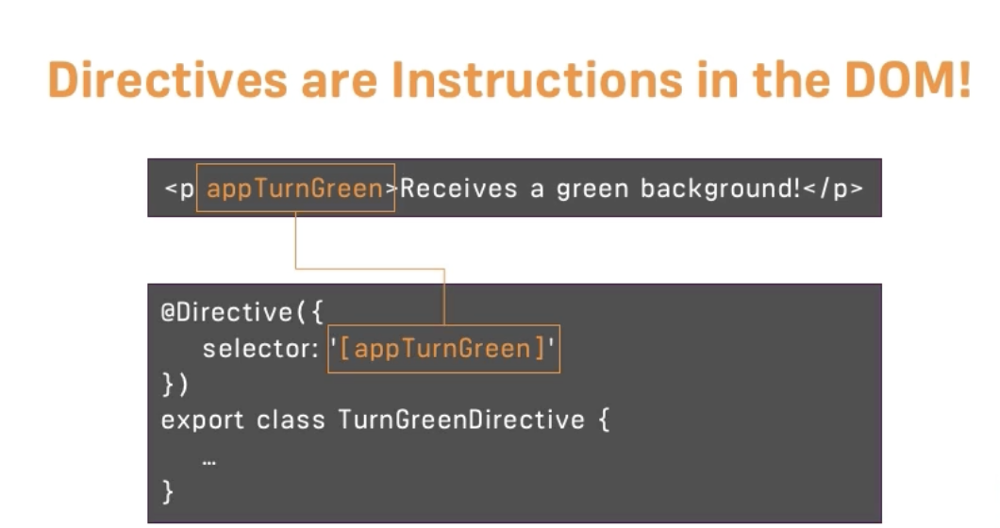

# Angular

Angular is a Javascript Framework which allows us to create reactive single page application.
Although we seem to visit different pages but it is a single page, with one html file and bunch of javascript code, every change is rendered in browser.
It helps with building interactive, modern web user interface.
Angular is also a collection of tools and features like CLI, Debugging tools, IDE plugins.
Framework like Angular simplify the process of building complex, interactive web user interfaces.

Angular bring these four main things to the table-

1. We can write declarative code instead of the imperative code. In imperative code we write step-by-step instructions that tell the browser what to do. In declarative code be define the target states, so in the some markup that are unlocked by angular that will not work with just vanilla javascript. And then we write the logic when these state got activated and deactivated when a event occurs, and then its Angular job to update the visible user interface.
2. Separation of concern via component. These are custom html elements. We can break up complex applications into simple building blocks, split up responsibilities and concerns, build a component once and reuse it as much as we want. Overall better development process. Modular application.
3. Embraces some object oriented programming features.
4. Typescript

Because it gives the user very reactive user experience. Javascript is much faster than to reach out server for every change.
And if we need data from the server we simply load the data in background, so the user get the same experience.
In this, Javascript, DOM changes, whatever displayed on the page (HTML code) during runtime. That's why we never see the refresh icon.

# Angular versioning

AngularJs (Angular 1) - Was not future proof due to the way it was written.
Angular1, Angular2, Angular4 ... (Angular3 was skipped)

Angular 2 - Was a complete rewrite of AngularJs. It was a complete new framework.
Angular has been super stable framework. Any changes are made in very backward-compatible way.

Angular 14 introduced standalone components.
Angular 16 introduced signals.

Updating npm:

    Run [sudo] npm install -g npm (sudo is only required on Mac/ Linux)

Updating the CLI

    [sudo] npm uninstall -g angular-cli @angular/cli

npm cache verify

    [sudo] npm install -g @angular/cli

    use ng serve --port ANOTHERPORT to serve your project on a new port

My changes are not reflected in the browser (App is not compiling)

Check if the window running ng serve displays an error. If that's not the case, make sure you're using the latest CLI version and try restarting your CLI.

Why we need Angular CLI?
We need such an extra tool to create angular projects, because the code we write when using the angular will actually will not be the code that runs just like that in the browser, instead it will need to be converted and optimized since we will use features in our angular code that are not native Javascript features. That's why we need a separate project that basically includes a build step that converts the code we write during development to code that can run in the browser once we are ready to ship and deploy the project.

To create the new app-

    ng new my-app

we can add three flags/configurations

    [sudo] ng new my-app --no-strict --standalone false --routing false

To run the development server

    [sudo] ng serve

To create the component folder

    [sudo] ng generate component my-component
    [sudo] ng g c my-component
    [sudo] ng g c my-component --skip-tests
    [sudo] ng g c my-component/nested

Angular first load the index.html page then we have these dynamically injected script imports and there imports will dynamically replace app-root with our own component.

# TypeScript

TypeScript is superset to the vanilla javascript. (Programming language extending javascript) It has more robust code which get checked when we write not just when we run. It have more features like (e.g Types, Classes, Interfaces, ...). But in the end as typescript can't run in the browser it is compiled to javascript and this compilation is handled by the cli (a project management tool).

It adds static typing to javascript

npm install typescript
npm tsc //to compile the file, will figure out which file to compile from the config file if there is no config file we can still give the file we want to compile at the end of the command.

//Primitive types: number, string, boolean
//More complex types: arrays, objects
//Function types, parameters

    let age: number = 12;
    let hobbies: string[];
    let person: { name: string; age: number; }; //tells the type of the variable is object
    let person: {}[];

--Type Inference
By default, tries to infer as many types as possible, without us giving the type of the variable.
Generally it is best practice not to assign the type of the variable which is initialized as soon as it is declared as it will be redundant.

--Union types

    let age: number | string = 12;

It allows us to save more than one type of data in our variables.

--Assigning Type Aliases

    type Person = {
    name: string;
    age: number;
    }
    let person: Person;
    let person: Person[];

--Function and types

    function add(a: number, b:number): number{
    return a + b;
    }

//as long as the typescript is able to infer the type of the function then avoid giving it explicitly.

--Generics

    function add<T>(a: T[], b:T): number{
    return a + b;
    }

//Generics are used when we want to create a function that can work with different types of data.
//This will automatically infer the return type based on the type of the parameters.

--class
Within the class to define a method we use the method shorthand notation.

    methodName(){

    } //we can't use the function keyword to create a method

--interfaces
doesn't exist in the vanilla javascript

    interface Human {
    name: string;
    age: number;

        greet: () => {}

    }

    let mac: Human;
    mac = {
    name: 'mac',
    age: 12,
    greet: () => {
    console.log('Hello');
    }
    }

//it look similar to the type but there is key difference is that interfaces can be implemented by classes and it forces that class to have that structure.

    class Teacher implements Human {

    }

    npx tsc --init

will add the tsconfig.json

    @Input() avatar!: string;
    //The ! mark told that  that value of the variable will be initialized even though typescript can't find it in the code.

     @Input({ required: true }) avatar!: string;
     //Ensures that the input has the definitely a value initialized otherwise it will throw the error.

npm install --save bootstrap@3

# The Basics

As angular single page application the first page that is loaded is index.html. Index.html has <app-root></app-root>, which is not the standard html tags but one of our own components.
@Component decorator, have selector property which assigns string as value and it holds the app-root described in index.html. This is the information angular needed to replace with the template of this component.
When we run the ng serve, it automatically creates javascript script bundles and automatically add the right imports in the index.html file, a convenience method for us.
After that first code to be executed is main.ts file. Now this starts our angular application by passing an app.module to the

    platformBrowserDynamic().bootstrapModule(AppModule)

method.
The AppModule is the root module of our application. It is the entry point of our application. It is the module that is responsible for bootstrapping.
AppModule comes from app.module,ts file, in which @NgModule have an object in which there is bootstrap array which basically lists all the components that should be know to angular at the point of time, it analyzes our index.html file.
Therefore angular knows about the AppComponent, it reads app.component.ts file and therefore knows this selector app route in turn its knows the html and css file with which to replace our app-root.

# Angular Essentials

## Project Structure

tsconfig files simply control how typescript code will be compiled to the typescript code under the hood. The compilation will be triggered automatically by angular cli.

package file manage the dependency of our applications.

angular.json which contains extra configurations settings for angular cli and angular related tools.

.editorconfig file contain rule for code editor for how the code should be formatted.

src>app where we build our angular components and write angular code.

style.css sets global style that will apply to the entire web application across all components.

index.html file is the main html file which will be loaded when the visitor visits website.

main.ts first code file to be executed when the angular application is loaded in the browser.

assets file where we could store images.

## Components

Decorators like @Component are used by Angular to add metadata & configuration to classes (and other things, as you'll see throughout the course).

In addition, TypeScript gives you more control over how properties are defined in classes.

There is main app component, root component which holds our entire application. So this root component, to this template, this html file off the app component is where we will add other components.
These component have their own template , own styling and they can be used more than once.

The nested components will not be added to the index.html file but the root component html file.
Their selector will be added to app component HTML file. As the whole application is bootstrapped with the root component.

    if inside the component we set the standalone property as true it will mark the component as standalone component. Component where standalone property is false are called module based component.

The standalone property is only available in angular 14 and above.
Despite the standalone property being true or false the way we work with the components and general features are same.

The aim behind the component tree is that the component that are the part of the same application or same tree will be able to work together and communicate with each other.

We have to register the App components in order to use them in them other components. For older angular version(ogv) we can do so by going in app.module.ts and in ngModule decorator providing the component in the declarations. For new Angular version (ngv) we need to provide the component in the component decorator imports of the component where we wish to use it.

In ngv you have to add the src/asstes to the the asset in angular.json

## AppModule and Component Declaration

AppModule is the bundle of functionality of our app and it basically gives angular the information which feature does my app have and use. It is an empty typescript class and we transform it by adding a decorator.
We don't add any other component than the AppComponent to the bootstrap array, as in this we want to add only those component which we will need at the time of starting our application in our index.html file.

We will add other component which is part of the app but not needed at the time of running the application in declarations. declarations already contains our AppComponent as it is also the part of the app.

The main idea behind Standalone Components is that you can build Angular components & apps without (or with less) @NgModules - i.e., Standalone Components allow you to write less (boilerplate) code.

You build a standalone component by adding the standalone: true property/value pair to the @Component decorator.

Like this:

    @Component({
    standalone: true,
    selector: 'app-cmp',
    template: '<h1>I work standalone!</h1>'
    })
    export class SomeComponent {}

Such components then don't have to (and shouldn't be) added to any @NgModule.

Therefore, if you only work with such components, no @NgModule is needed at all.

## Creating components with CLI and nesting components

ng generate component <component-name> or ng g c <component-name> will create a component with the name <component-name> and it will be added to the app.module.ts file.
This command allows us to generate some elements supported by angular like component.

## working with component template

We can write the template code within the templateUrl if we want.
styleUrls takes an array as our html page can have multiple style files.
We can give inline styles using the styles property instead of styleUrls. styles property also take the array as an argument but the style written in inline.

## Component Selector

component selector acts like a css selector. so we can do much more just like with the css selector.
we can give the selector as an attribute '[selector-name]' (should be string ''), this way we can't use it as tag but as the attribute of an element, for ex 

.
Another way is as class like in css, '.selector-name' then we can use it as 

.
But selecting by id and pseudo selectors will not works as they are not supported.

## Databinding

Communication between the typescript code(Business logic) and template(HTML).
We want to output data from our typescript code in the HTML code we can do so by

     String interpolation {{ data }} or Property Binding [property]="data" .

     [src]="'../../assets/users/' + selectedUser.avatar".
     We can create dynamic value in jit

But such computation should not be done inside the template
We can do it in the component class and then pass it to the template.

    get imagePath() {
        return '../../assets/users/' + this.selectedUser.avatar;
    }
    //This is a getter function
    

Property Binding" - a key Angular feature that allows you to bind element properties to dynamic values.

For example,  binds the src property of the underlying HTMLImageElement DOM object to the value stored in someSrc.

Whilst it might look like you're binding the src attribute of the  tag, you're actually NOT doing that. Instead, property binding really targets the underlying DOM object property (in this case a property that's also called src) and binds that.

For example, when binding ARIA attributes, you can't target an underlying DOM object property.

Since "Property Binding" wants to target properties (and not attributes), that can be a problem. That's why Angular offers a slight variation of the "Property Binding" syntax that does allow you to bind attributes to dynamic values.

It looks like this:

    
...

By adding attr in front of the attribute name you want to bind dynamically, you're "telling" Angular that it shouldn't try to find a property with the specified name but instead bind the respective attribute - in the example above, the aria-valuenow and aria-valuemax attributes would be bound dynamically.

And we can react to user event with event Binding (event)="expression".
We can also use two way binding [(ngModel)]="data" to bind the data in both direction.

We can also use ngClass to add class dynamically and ngStyle to add style dynamically.

String interpolation has only one condition as long as anything between {{ }} is resolved to a string it will work we can even pass function in this. Also we can't write multiline expressions here, so that's why we can't use if and for control structure but can use ternary operator.

In property binding we directly bind to the native property the element has.

If we want to output something on our template then we should use the string interpolation, but if we want to change the some of property of HTML element or component the we should use property binding.

## Even Binding

we can react to user event with event Binding

    (event)="expression". (event) is the event we are waiting for, and expression is something that should happen when the event occurs.

How do you know to which Properties or Events of HTML Elements you may bind? You can basically bind to all Properties and Events - a good idea is to console.log() the element you're interested in to see which properties and events it offers.

Important: For events, you don't bind to onclick but only to click (=> (click)).

The MDN (Mozilla Developer Network) offers nice lists of all properties and events of the element you're interested in. Googling for YOUR_ELEMENT properties or YOUR_ELEMENT events should yield nice results.

## Passing and using data with the event binding

To get the value the user enter we need to pass the $event as the argument in the expression for the event listener.
(input)="onUpdateUser($event)".
$event is a reserved variable name that we can use in the template when we are using event binding. $event as an argument will simply be the data emitted with that event. When these event are fired they emit some data and we can catch this data and pass it by using $event.

## Two way Data Binding

Important: For Two-Way-Binding (covered in the next lecture) to work, you need to enable the ngModel directive. This is done by adding the FormsModule to the imports[] array in the AppModule.

You then also need to add the import from @angular/forms in the app.module.ts file:

    import { FormsModule } from '@angular/forms';

    [(ngModel)]="field-name"

it provides two way data binding, so that it will trigger the input event and update the field-name in our component and also if the field-name is changed then it will update the value of input element.

## State change - zone.js

Zone.js is a library that allows you to run code in a zone.
A zone is a context in which you can run code and have it run in a specific way.
Angular uses zone.js to create so-called zones around our components, which in the end kind of invisible grouping mechanism where it listens for all kinds of events that could trigger state changes.
For example, you can run code in a zone that will automatically run change detection when the code is done running.

What Zone.js is that it automatically listens to all possible user events that could occur on a website for example, as well as some other possible events that could occur. Like a timer expiring,
when such a event occurs, it checks the angular application for possible changes and make them.

    export class UserComponent {
     selectedUser = DUMMY_USERS[randomIndex];

     get imagePath() {
       return '../../assets/users/' + this.selectedUser.avatar;
     }

     onSelectUser() {
       const randomIndex = Math.floor(Math.random() * DUMMY_USERS.length);
       this.selectedUser = DUMMY_USERS[randomIndex];
       console.log(this.selectedUser);
     }

    This is one way of doing state change in which we rely on Zone.js and angular's change detection mechanism. This works automatically, no special instruction required. Supported since angular 2.

    And the other mechanism uses a concept called signal.

## Signal

Using signals to notify angular about value changes and required UI updates. Require usage of special signal instruction and code. Supported since angular 16.

    Signals are trackable data containers
    A signal is an object that stores a value(any type of value, including nested objects).
    And then we can use that value in the template.
    And angular therefore able to setup a subscription behind the scenes which will make sure that when we change that value, angular will be notified about the change, then angular is able to identify in our template where the value (signal) is being used and update these places.

This is how we can create a signal

      export class UserComponent {

        selectedUser = signal(DUMMY_USERS[randomIndex]);

      get imagePath() {
        return '../../assets/users/' + this.selectedUser().avatar; //this is how we access the value inside the user
      }

      onSelectUser() {
        const randomIndex = Math.floor(Math.random() * DUMMY_USERS.length);
        this.selectedUser.set(DUMMY_USERS[randomIndex]);
      }
    }

Advantage of the signal is that it can get rid of Zone.js and this zone concept. So it allows angular to perform change detection and UI updating in more efficient manner. It doesn't have to check everything for every possible event that could anywhere.

For signals unlike zone we will not use getter but

    imagePath = computed(
    () => '../../assets/users/' + this.selectedUser().avatar
    );

Angular analyzes if we are reading the value inside the computed function, and if that's the case it again sets up a subscription to that signal that's being used in here, and whenever the signal receives a value and only then angular will recompute the image path here. So it's efficient it will not check everything in the component only this property which is being recomputed.

We can use the signals with the input also

    avatar = input();
    avatar = input(''); //sets the default value ''
    avatar = input<string>(''); //sets the default value '' and tells the it is of type string
    input.required<string>(); //tells that should have value.

These input signals are read only signals that means their value change only outside the component we can't change the value from inside the user component.

## Output and Emitting Data

      @Output() select = new EventEmitter();

       <app-user
        [id]="users[1].id"
        [avatar]="users[1].avatar"
        [name]="users[1].name"
        (select)="onSelectUser($event)"
      ></app-user>

There is another way of emitting data instead os using output decorator we can use output function.

    select = output<string>();

This is not give us a signal, and like the output decorator it also give us custom event we can emit.

## Working with potentially undefined values

    @Input() name?: string; or  @Input() name: string | undefined;
    tells the user can be undefined or string
    [name]="selectedUser?.name"
    tells if selectedUser is undefined so use undefined

## Type aliases and interfaces

Sometimes defining the type of variable as object within the component can become cumbersome as they are can be quite large, it is better to outsource them.
Type aliases are used to define the type of variable.
Interface can also do the same but they are only applicable for objects

    type User = {
    id: string;
    avatar: string;
    name: string;
    };

    interface User {
        id: string;
        avatar: string;
        name: string;
    };

## Directives

With angular, we can enhance the elements by adding so-called directives to them.
Directives are instruction in DOM. Components are such kind of instructions in the DOM. As when we use the selector of the component in the template we are instructing the angular to put the component template in the place of this selector in the template that contain the selector.
Component are a kind of the directives with template.
Directive unlike components don't have template.
There can be directives without the template to, we can build such custom directives. We typically add directives with attribute selector, but technically selector of a directive can be configured just like the selector of a component.

    

ngif is a directive shipping with angular.
ngif is a directive that is used to conditionally render the template. It takes the condition as the argument and if the condition is true then it add the element.
ngif is a structural directive as it changes the structure of our dom, it either add the element or not add it. \* is required in prefix of ngif (\*ngif) otherwise it will not work. As it is a structural directive normal attribute directive doesn't require \*.

If you're in an Angular 17 project (and only then!), you can also use an alternative syntax for outputting conditional content:

Instead of using \*ngIf, you can use a built-in @if template control flow statement.

    @if (someCondition) {
      
Only visible if 'someCondition' is true

    }

would replace

    
Only visible if 'someCondition' is true

The advantage of the new syntax is that it can be slightly more efficient under the hood and that it does not rely on NgIf or the CommonModule being imported / available.

we can also use ngif with else

    

    {{ serverName }}
    

    <ng-template #noServer> //This is an local reference that can we used in the template
      
No Server Created

    </ng-template>

ngStyle allows us to dynamically set the style, ngClass allows us to dynamically add and remove CSS classes.

    <h5 [ngStyle]="{ backgroundColor: getColor() }">
     Server with ID {{ serverId }} is {{ getServerStatus() }}
    </h5>

Here ngStyle only works with property binding, here it binds the property of the directive not the directive itself. It takes object as an argument with style name as key and it value as value.
ngClass also only works with property binding.

    <h5 [ngStyle]="{ backgroundColor: getColor() }"
    [ngClass]="{online: serverStatus === 'online'}">
     Server with ID {{ serverId }} is {{ getServerStatus() }}
    </h5>

ngClass also takes object as an argument with key being the CSS class name and value being the expression which tell us that whether to add this CSS class or not.

ngFor Directive

    

If you're in an Angular 17 project (and only then!), you can also use an alternative syntax for outputting conditional content:

Instead of using \*ngFor, you can use a built-in @for template control flow statement.
The track is used as since we are outputting data dynamically here and angular want to keep the track of every item that is being rendered so that if list input data would change. Angular could use already rendered item list instead of recreating the entire list.
Track tells which unique identification criteria angular could assign to every list item it outputs.

    @for (item of items; track item.id) {
      <li>{{ item.title }}</li>
    }

    @for (user of users; track user.id) {
    <li>
      <app-user [user]="user" (select)="onSelectUser($event)"></app-user>
    </li>
    }

would replace

    <li *ngFor="let item of items">{{ item.title }}</li>
    <li *ngFor="let item of items; let i = index">{{ item.title }}</li>

The advantage of the new syntax is that it can be slightly more efficient under the hood and that it does not rely on NgFor or the CommonModule being imported / available.

The track item.id part is required when using this new syntax - it ensures that Angular can efficiently track and re-render (if needed) the list items.

NgModel Directive is an Element enhancement that helps with extracting (or changing) user input values.

    <input ngModel>

We can also use signals with ngModel

## Dynamic CSS styling with class bindings

    <button [class.active]="selected" (click)="onSelectUser()">
    //Here we can use this and set the property value to true or false.

## Handling Form Submission

The for submission is automatically prevented if we are importing FormsModule. Because inside this form module includes a component built by the angular team, which uses the form element tag as a selector and thus take control of the form under the hood automatically.
This form component which took control of the form will listen for the submission event and prevent it from happening.
But we still want to perform some action of our own when the form is submitted. We can do so by using ngSubmit.

    (ngSubmit)

## Content Projection

Content projection is a way to pass content into a component.
We can use ng-content to pass content into a component.
If we want to use another component template as a wrapper around the another component we need to pass the ng-content where we want to wrap it or otherwise it will ignore any content other than define in its own component template by default.

    app-card component
    

     <ng-content></ng-content>
    

    wrapped component
    <app-card>
    <button [class.active]="selected" (click)="onSelectUser()">
      
      {{ user.name }}
    </button>
    </app-card>

## Pipes

Pipes are the output transformers, things that transform output in templates.

     <time>{{ task.dueDate | date }}</time>
     //this will transform the date to particular type which is described by the angular built in transformer date.

     <time>{{ task.dueDate | date: 'fullDate' }}</time>

## Services

The idea behind services is that typically it performs a operation and/or manages some data.
In order to keep our component code lean and clean which is generally the practice it is better to make utilization of services.
We can instantiate the service class and make use of that in other components but the problem with this approach is the instance used in each component will be unique, we wouldn't be sharing the same object, so even if we make changes in data in one component it will not be reflected in other component.

The solution to this is to use another powerful tool in conjunction with services is Dependency injection. The idea behind the di is that we don't create the instance but tell angular to do it and let it create it.
We tell angular what type of value we need and angular creates it and provides it as an argument.

One way to do it is using the constructor of the other component.
And We can use the @Injectable() decorator to tell angular that this class is a service and can be injected into other components.

    private taskService: TaskService;
    constructor(taskService: TaskService) {
      this.taskService = taskService;
    }

    or
    constructor(private taskService: TaskService) {}
    //this will create the instance of the service and inject it into the constructor.
    but angular will not automatically scan all the files and folders for the TaskService class we have to made it injectable and we can do so by

    @Injectable({ providedIn: 'root' })
    export class TaskService {}

One other way is using inject function of angular core module.

      private taskService = inject(TaskService);

inject function inject a dependency and provide it as a value for the taskService property.

## Using local storage for Data Storage

    constructor() {
       const tasks = localStorage.getItem('tasks');

    if (tasks) {
      this.tasks = JSON.parse(tasks);
    }
     }

     private saveTasks() {
       localStorage.setItem('tasks', JSON.stringify(this.tasks));
     } // we can call this function wherever change in task data occurs

# Angular Essentials - Working with modules

Aside from standalone way of building components we can use one more way of building components, which is Angular modules.
We can use Angular modules for grouping components together and for structuring our application.
Angular modules exist due to historic reasons, as there was no standalone components when angular 2 was released in 2016.

The difference between these two is that the other component that we use in a component need to be specified in the imports of that component in standalone components but in angular modules instead of importing the components on per component basis, we instead create a module that simply combines all the components.
The advantage is that the component configuration gets leaner but on the other side we have to create separate module and it is not clear which component is using which other component.

We need to use this to bootstrap angular app in main.ts

    platformBrowserDynamic().bootstrapModule(AppModule);
    //AppModule is the root module of our application
    //bootstrapModule is a function that takes a module as an argument and bootstraps the application
    //platformBrowserDynamic is a function that returns a platform object that can be used to bootstrap the application

After that we can either remove the standalone and import config from component or set standalone to false and remove imports. Then create app.module.ts and

    @NgModule({
      declarations: [
        AppComponent,
        UserComponent,
        TasksComponent,
      ],
      bootstrap: [AppComponent],
    })
    export class AppModule {}

We can also keep the component standalone while using the angular module by adding the import configuration in NgModule decorator in app Module.
It can be useful in the case when we are migrating from one to another.

    @NgModule({
         declarations: [
           AppComponent,
           UserComponent,
           TasksComponent,
         ],
         bootstrap: [AppComponent],
         imports: [BrowserModule, FormsModule, NgModule],

    })
    export class AppModule {}

We don't need to have only one module, if our application is large it is better to break the app module into multiple modules.

    @NgModule({
    declarations: [CardComponent],
    exports: [CardComponent],
    })
    export class SharedModule {}
    //We can mention the component that is needed and also needed to mention the component in the export to tell the angular the Card Component is available to all the modules that uses the shared module.

## Union Types

To allow for multiple types in a single value you can use Union Types: myVal: number | string

# Angular Essentials - Time to practice

The project structure of this section has one important difference compared to the structure from the previous section: Images (and statically served assets in general) are now stored in the public/ folder - NOT in a nested assets/ folder!

To reference images stored in the public/ folder you would use a path like this:  - i.e., the public folder name is NOT part of that path (it's NOT )

# Debugging

Javascript files supports source maps, source maps are a little of addition, DCLI adds kind of adds to our bundle which allow the browser to translate our javascript code to typescript code or to map simply our javascript code to our typescript file. In the development only these source maps will be stripped out for production.

In order to debug our typescript files we can go to the developer mode> sources> webpack> . folder> src> app.

Here we can see our typescript files and we can set the breakpoints and debug our code.

# Components and DataBinding Deep Dive

We can use property and even binding not only on HTML elements and their native properties and events, but also on directives. But we can also use it on our component and bind to our custom properties and events. We can emit our own events.

    By default all properties of components are only accessible inside the components not outside, and this is a good thing as we wouldn't want to bind all the properties from the outside.

So if we want to allow the parent components bind to the property of the child components, we need to add the decorator to that property. Decorator are not only available for the classes.

    We need to add the @Input () decorator to the property that we want to allow to be binded by the parent components.

We can pass the alias inside the @Input('alias-name') then we can bind using the alias-name only not the original property name.
